# mimicfox

A Cutting edge firefox minimal style userChrome.css that enhance Windows 11 mica and mimic Microsoft Edge with several community themes inspired.

## Preview

[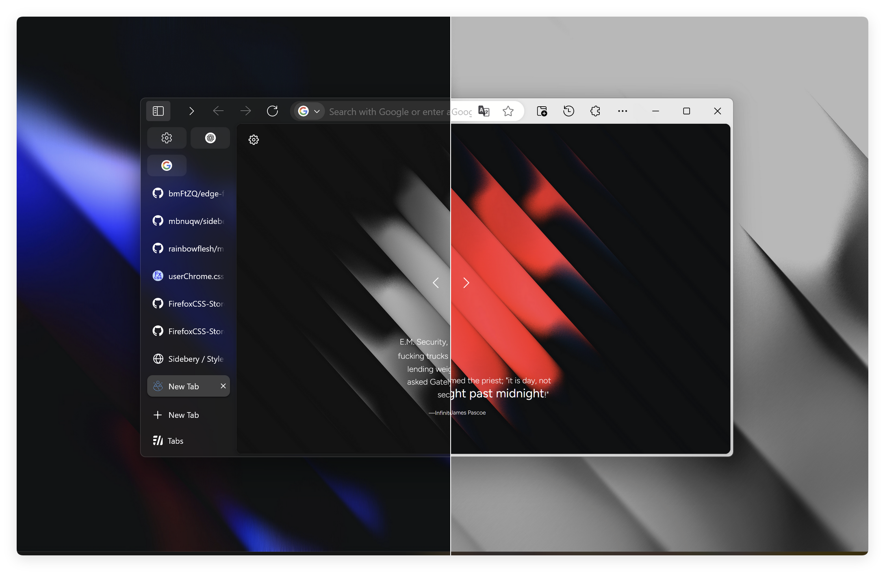](https://rainbowflesh.github.io/html/mimicfox.html "click image show light/dark theme comparison")

###### click image show light/dark theme comparison

## Installation

1. Download [code](https://github.com/rainbowflesh/mimicfox/archive/refs/heads/main.zip) or clone this [repo](https://github.com/rainbowflesh/mimicfox.git)
2. Unzip and move to `about:profiles` > `Profile` > `Root Directory`, change folder name to `chrome`.
3. Go to [about:config](about:config), change following preference

   > `toolkit.legacyUserProfileCustomizations.stylesheets` = `true`

   > `svg.context-properties.content.enabled` = `true`

4. Restart browser, or `firefox.exe -purgecaches`.

### Available configs

| `about:config` preference name           | value (Caps as default/recommend) | description                                                                                                               |
| ---------------------------------------- | --------------------------------- | ------------------------------------------------------------------------------------------------------------------------- |
| `browser.tabs.allow_transparent_browser` | TRUE/false                        | Allow browser framework transparent                                                                                       |
| `widget.windows.mica`                    | TRUE/false                        | Enable mica effect on Windows 10/11                                                                                       |
| `widget.windows.mica.extra`              | TRUE/false                        | Enable custom extra mica content (Require [MicaForEveryone](https://github.com/MicaForEveryone/MicaForEveryone))          |
| `widget.windows.mica.popups`             | TRUE/false                        | (Firefox 137)                                                                                                             |
| `widget.windows.mica.popups`             | 0 or 1 or 2                       | Disabled / Enabled / Auto (Firefox 138+)                                                                                  |
| `widget.windows.mica.toplevel-backdrop`  | 0 or 1 or 2 or 3                  | Auto / Mica / Acrylic / MicaAlt (Firefox 138+)                                                                            |
| `toolkit.tabbox.switchByScrolling`       | TRUE/false                        | switchByScrolling.gif                                                                                                     |
| `uc.plugin.sidebery`                     | true/FALSE                        | Sidebery compatible, copy everything in `./sidebery.css` to make sidebery looks like native vertical tab styles           |
| `uc.plugin.simpleMenuWizard`             | TRUE/false                        | To use simpleMenuWizard put entire `simpleMenuWizard-master` to `./plugins/`                                              |
| `uc.plugin.edge-frfox`                   | TRUE/false                        | Enable edge-frfox styles                                                                                                  |
| `uc.tweak.always-show-navbar-button`     | true/FALSE                        | 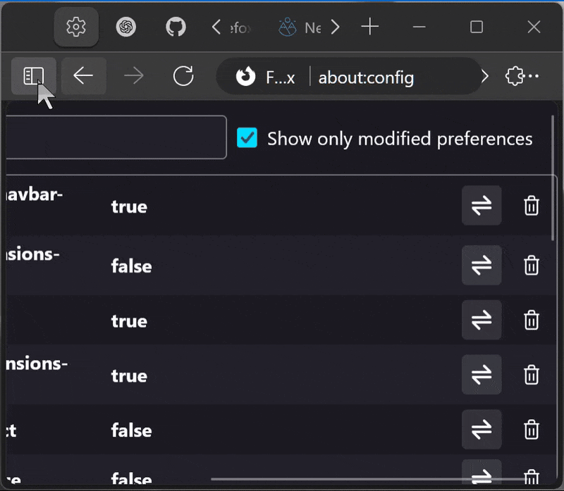 Always show navbar buttons even window really have no space for them |
| `uc.tweak.compact-extensions-menu`       | true/FALSE                        | 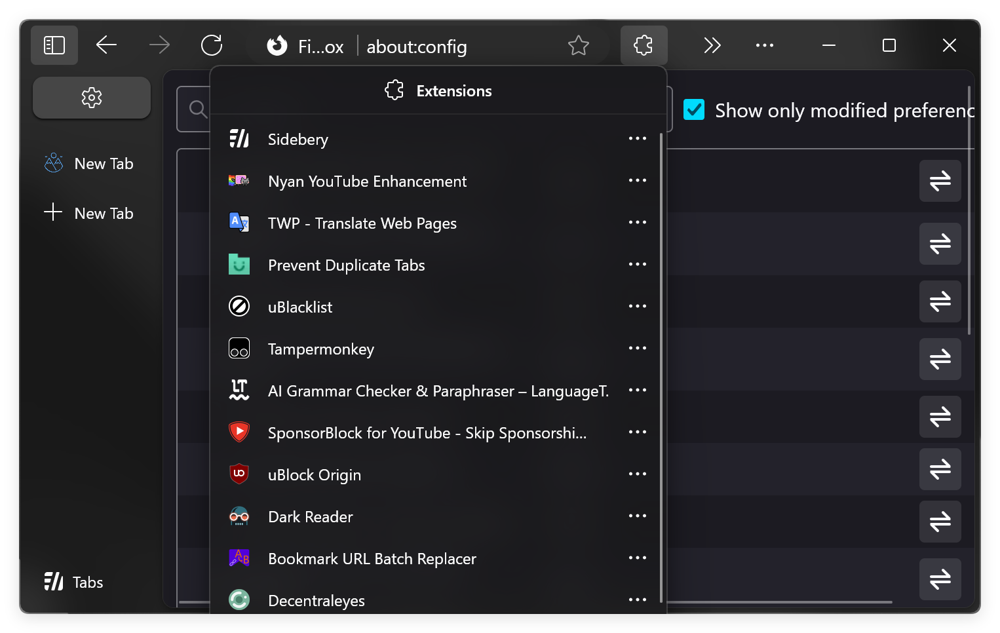                                                                                     |
| `uc.tweak.icon-only-extension-menu`      | TRUE/false                        | 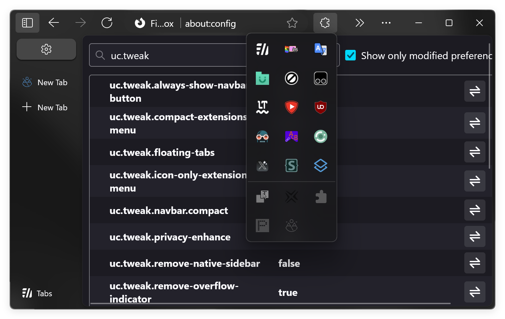                                                                                     |
| `uc.tweak.floating-tabs`                 | TRUE/false                        | 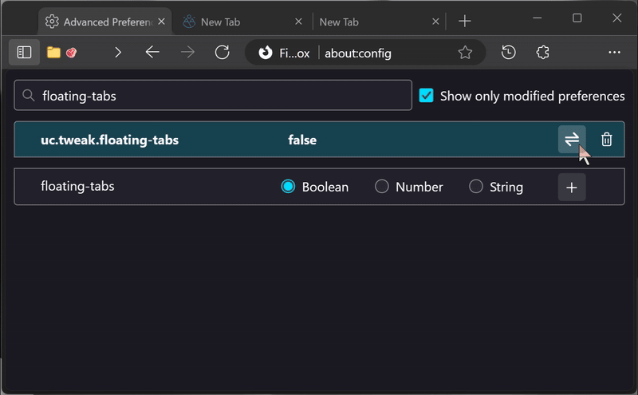                                                                                  |
| `uc.tweak.remove-native-sidebar`         | true/FALSE                        | 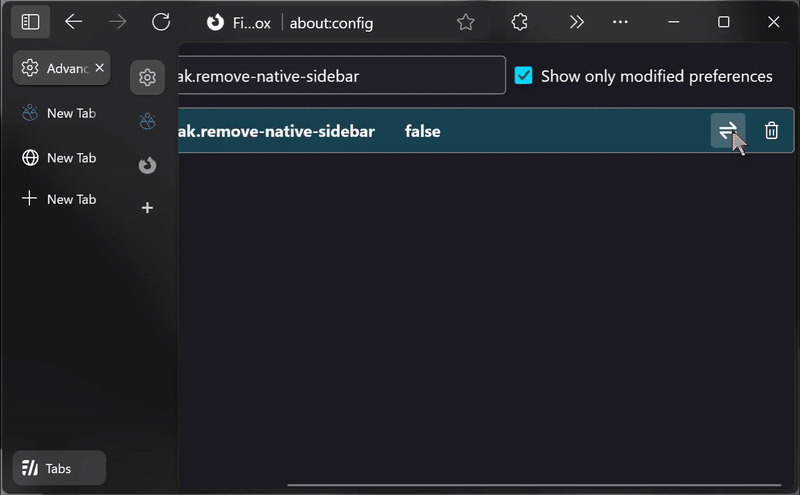                                                                          |
| `uc.tweak.remove-tab-close-button`       | true/FALSE                        | 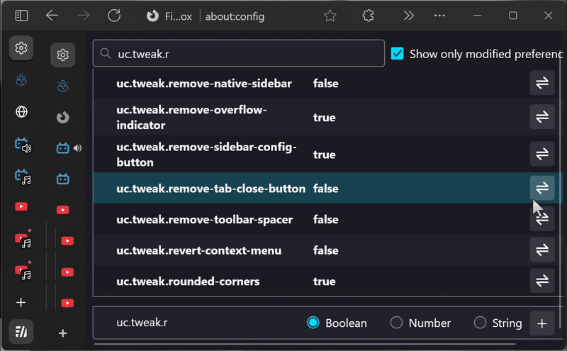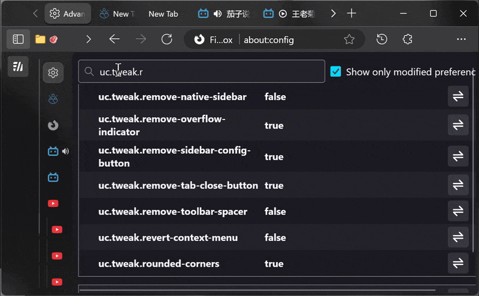                     |
| `uc.tweak.navbar.compact`                | true/FALSE                        | 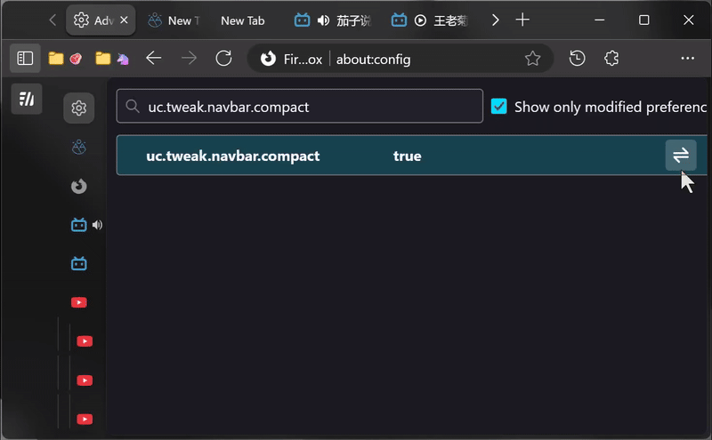                                                                                 |
| `uc.tweak.privacy-enhance`               | true/FALSE                        | 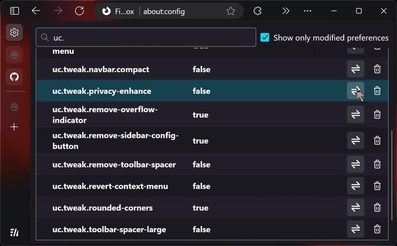                                                                                |
| `uc.tweak.remove-overflow-indicator`     | TRUE/false                        | 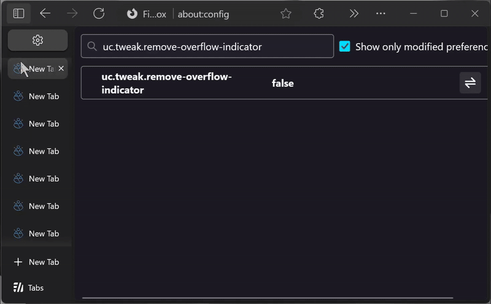                                                                      |
| `uc.tweak.remove-sidebar-config-button`  | TRUE/false                        | 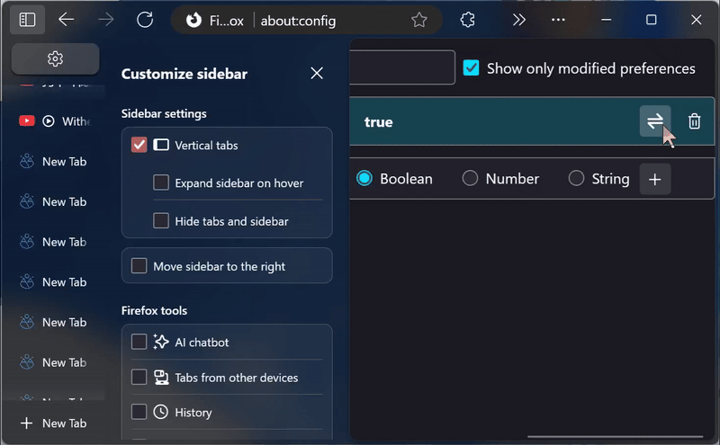                                                                   |
| `uc.tweak.remove-toolbar-spacer`         | true/FALSE                        | 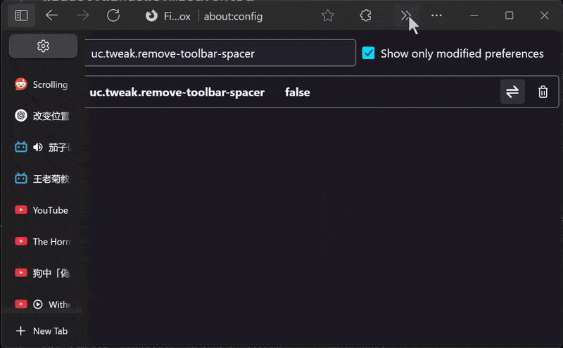                                                                          |
| `uc.tweak.revert-context-menu`           | true/FALSE                        | Disable context menu css                                                                                                  |
| `uc.tweak.toolbar-spacer-large`          | true/FALSE                        | 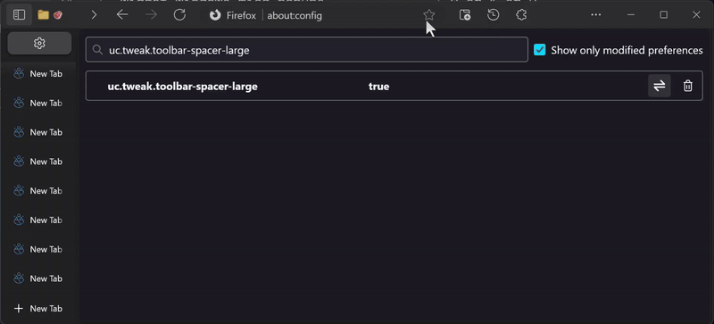                                                                           |
| `uc.tweak.rounded-corners`               | TRUE/false                        | 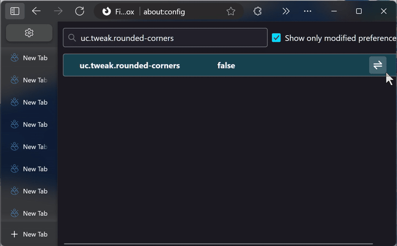                                                                                |

## Relate links

- https://github.com/bmFtZQ/edge-frfox
- https://github.com/muckSponge/MaterialFox
- https://github.com/Guerra24/Firefox-UWP-Style
- https://github.com/Aris-t2/CustomJSforFx
- https://github.com/mbnuqw/sidebery
- https://github.com/joelshepherd/tabliss
- https://github.com/MicaForEveryone/MicaForEveryone
